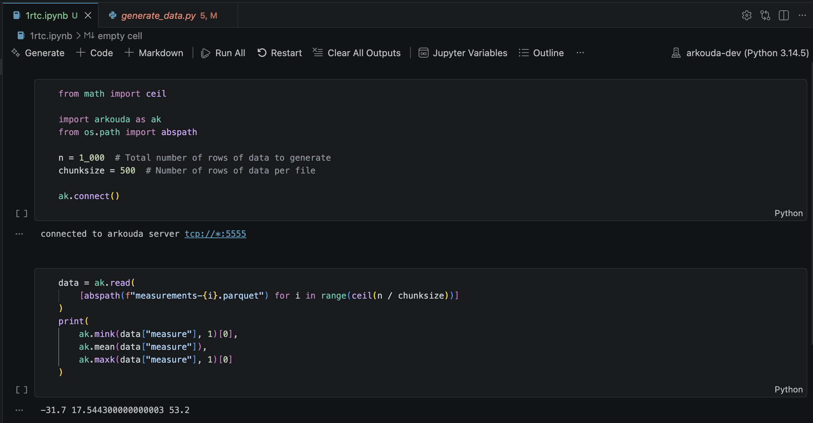
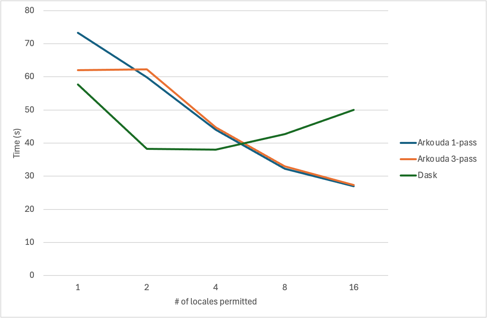

# Installing Anaconda, Arkouda, and Chapel
Installation was mostly straightforward, except for a few issues:
* Installing Anaconda via Homebrew doesn't automatically give access to the `conda` command! Turns out I needed to add Anaconda to PATH manually.
* I first tried to install Chapel via Homebrew, but interestingly, that didn't come with a `util/` directory to set environment variables! So I ended up building Chapel from source.

# Building the Arkouda Server
Following the steps outlined in the [documentation](https://bears-r-us.github.io/arkouda/setup/BUILD.html), I eventually got ran into pip dependency errors when running `make chapel-py-env`? Apparently, it's unrelated noise that's safe to ignore, so I continued forward.


But now when building the server, one test fails:

I describe the error in detail in [this GitHub issue](https://github.com/Bears-R-Us/arkouda/issues/5494). Essentially, a test named `test_export_hdf` fails due to mismatched columns, and this is caused by a higher-than-supported `hdf5` version `2.10.0`. I ended up resolving this by changing Arkouda's `hdf5>=1.12.2` dependency to `hdf5==1.14.6`.

Smooth sailing for now. Now after running `make`, we've got a server ready to run with `./arkouda_server`!

# Starting Simple: Ungrouped Min, Mean, and Max
Now that I've got the Arkouda server up and running, it's time to test it out! I started with 1,000 rows of data spread across 2 Parquet files, and I used Arkouda to simply calculate the min, mean, and max of them. No grouping by stations yet, just to get a feel of what we're working with.


Let's now do it grouped by station. My reference Dask implementation adapted from Coiled's Dask solution is as follows:

```py
import dask.dataframe as dd

df = dd.read_parquet(
    "./",
    dtype_backend="pyarrow",
)

df = df.groupby("station").agg(["min", "max", "mean"])
df = df.sort_values("station").compute()

print(df)
```

Now, let's do it with Arkouda. The built in Arkouda `grouped.min`, `grouped.mean`, and `grouped.max` functions compute the min, mean, and max across each group over three separate parallelized passes through the data.

```py
def compute_arkouda_stats(data):
    stations = data["station"]
    measures = data["measure"]

    # Sort by station name on the server so group keys are in station order.
    order = ak.argsort(stations)
    stations = stations[order]
    measures = measures[order]

    grouped = ak.GroupBy(stations, assume_sorted=True)

    # One pass over grouped values.
    station_keys, mins, means, maxs = grouped.min_mean_max(
        measures, skipna=True
    )

    return station_keys, mins, means, maxs
```

This works great, but what if we wanted to calculate the min, mean, and max in only one pass? Arkouda doesn't currently provide a built-in function for that, so I took this as an opportunity to make my own custom function!

# Adding a Grouped `min_mean_max` via Segmented Reduction
* My new `GroupBy.min_mean_max(values, skipna=True)` returns the unique keys plus a min, mean, and max per group, all computed in a single server-side pass.
* On the Python client side (`groupbyclass.py`), I added a new `min_mean_max` reduction type that sends the existing `segmentedReduction` command with `op="min_mean_max"`. The server replies with three symbol names joined by `+`, which I parse back into three separate pdarrays (mins, means, maxs).
* The heavy lifting happens in Chapel (`ReductionMsg.chpl`) in a new `segMinMeanMax` proc. Instead of three reductions, it does one segmented parallel scan over the values.
* Each element is mapped to a tuple `(resetAtSegmentStart, hasValid, min, sum, max, count)`. The first element of every segment is flagged as a reset point.
* I wrote a custom scan operator, `ResettingMinMeanMaxScanOp`, that accumulates min, sum, max, and count, but resets its running state whenever it hits a segment boundary. After the scan, the last element of each segment holds the fully combined stats for that group.

After wiring that in place, we can now use our new `min_mean_max` function in our calculation!

```py
def compute_arkouda_stats(data):
    stations = data["station"]
    measures = data["measure"]

    # Sort by station name on the server so group keys are in station order.
    order = ak.argsort(stations)
    stations = stations[order]
    measures = measures[order]

    grouped = ak.GroupBy(stations, assume_sorted=True)

    # Three passes over grouped values for comparison.
    station_keys, mins = grouped.min(measures, skipna=True)
    _, means = grouped.mean(measures, skipna=True)
    _, maxs = grouped.max(measures, skipna=True)

    return station_keys, mins, means, maxs
```

# 1 Billion Lines
Now let's try all three approaches out on one billion lines!

* Initially, Dask appears to beat out Arkouda on a smaller number of nodes/locales. However, as we increase the number of available nodes, Arkouda seems to fly past Dask in terms of performance.
* Why does Dask slow down with more nodes? One possible explanation is under-parallelization, where the extra compute being added isn't necessarily parallelizing computations any further.
* It's also interesting to note that the three-pass approach seems to be superior to the one-pass approach with one node, but the one-pass approach becomes marginally faster than the three-pass one once we start using two or more nodes.
