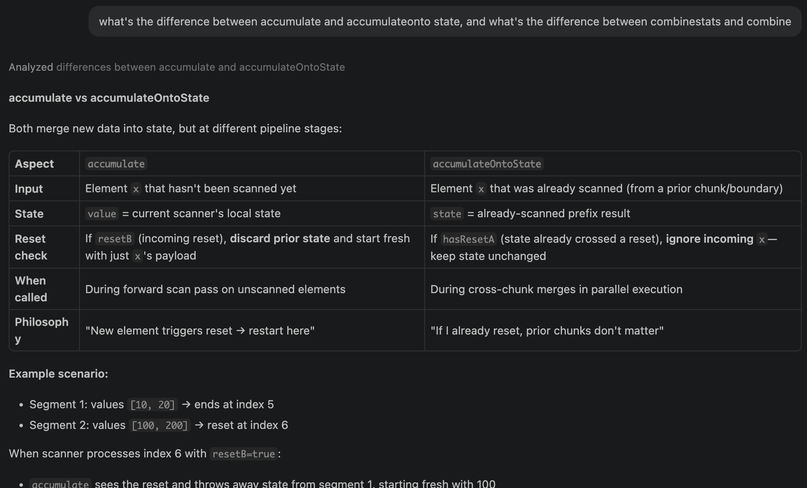
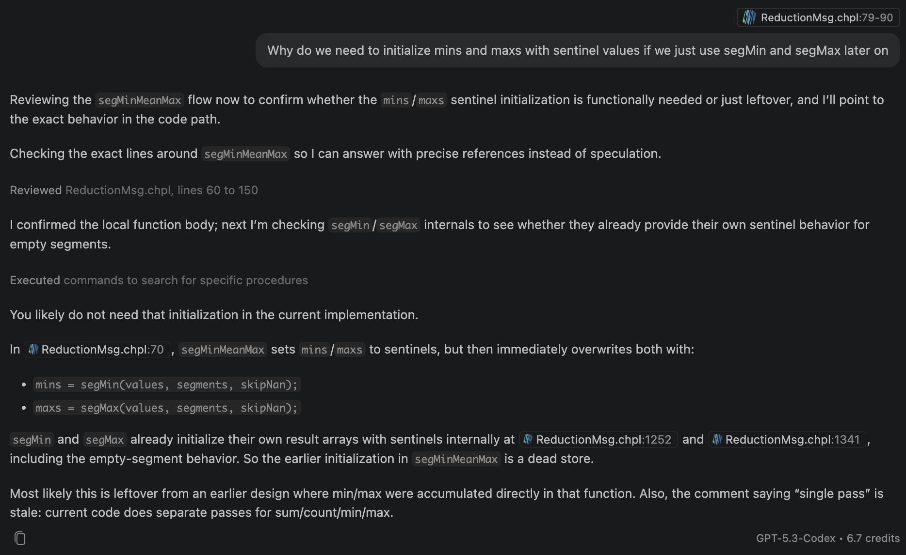
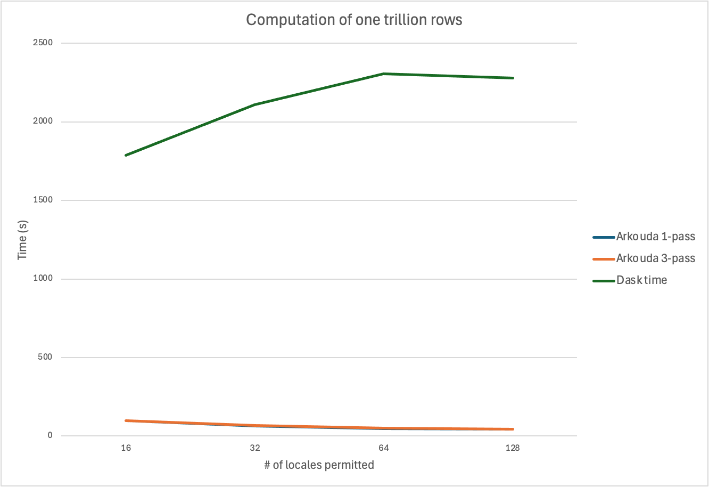

# 1 Billion/Trillion Row Challenge using Arkouda

How performant are different programming languages and libraries with data processing? The [1 billion row challenge](https://1brc.dev/) has become a popularized, fun way to test this. The task itself is simple: Calculate the min, mean, and max of 1 billion measurements, grouped by station type. The [1 trillion row challenge](https://github.com/coiled/1trc) takes this a step further, extending the challenge to 1 trillion rows of data.

At this scale, parallel and/or distributed computing is almost certainly needed for reasonable compute times. With Chapel being a language specifically designed for parallel computing and [Arkouda](https://github.com/Bears-R-Us/arkouda) acting as a bridge between Python and parallelized Chapel code, I wanted to test how Arkouda fares against more traditional parallelized Python approaches, such as using Dask.

With that, let's start setting up Arkouda!

## Installing Anaconda, Arkouda, and Chapel
Installation was mostly straightforward (following the [documentation](https://bears-r-us.github.io/arkouda/setup/BUILD.html)), aside from a few issues:
* Installing Anaconda via Homebrew doesn't automatically give access to the `conda` command! Turns out I needed to add Anaconda to PATH manually.
* I first tried to install Chapel via Homebrew, but interestingly, that didn't come with a `util/` directory to set environment variables! So I ended up building Chapel from source.

## Building the Arkouda Server
Following the steps outlined in the [documentation](https://bears-r-us.github.io/arkouda/setup/BUILD.html), I eventually ran into one test failing upon building the server:


I describe the error in detail in [this GitHub issue](https://github.com/Bears-R-Us/arkouda/issues/5494). Essentially, a test named `test_export_hdf` fails due to mismatched columns, and this is caused by a higher-than-supported `hdf5` version `2.10.0`. I ended up resolving this by changing Arkouda's `hdf5>=1.12.2` dependency to `hdf5==1.14.6`.

Aside from that, smooth sailing for now. Now after running `make`, we've got a server ready to run with `./arkouda_server`!

## Arkouda Warm-Up: Ungrouped Min, Mean, and Max
Now that I've got the Arkouda server up and running, it's time to test it out! I started with 1,000 rows of data spread across 2 Parquet files, and I used Arkouda to simply calculate the min, mean, and max of them. No grouping by stations yet, just to get a feel of what we're working with.
```py
from math import ceil

import arkouda as ak
from os.path import abspath

n = 1_000
chunksize = 500

ak.connect()

data = ak.read(
    [abspath(f"measurements-{i}.parquet") for i in range(ceil(n / chunksize))]
)
print(
    ak.mink(data["measure"], 1)[0],
    ak.mean(data["measure"]),
    ak.maxk(data["measure"], 1)[0]
)
```

Let's now do it grouped by station. My reference Dask implementation adapted from Coiled's Dask solution is as follows:

```py
import dask.dataframe as dd

df = dd.read_parquet(
    "./",
    dtype_backend="pyarrow",
)

df = df.groupby("station").agg(["min", "max", "mean"])
df = df.sort_values("station").compute()

print(df)
```

Let's pivot to doing it with Arkouda. The built in Arkouda `grouped.min`, `grouped.mean`, and `grouped.max` functions compute the min, mean, and max across each group over three separate parallelized passes through the data.

```py
def compute_arkouda_stats(data):
    stations = data["station"]
    measures = data["measure"]

    # Sort by station name on the server so group keys are in station order.
    order = ak.argsort(stations)
    stations = stations[order]
    measures = measures[order]

    grouped = ak.GroupBy(stations, assume_sorted=True)

    # Three passes over grouped values.
    station_keys, mins = grouped.min(measures, skipna=True)
    _, means = grouped.mean(measures, skipna=True)
    _, maxs = grouped.max(measures, skipna=True)

    return station_keys, mins, means, maxs
```

This works great, but what if we wanted to calculate the min, mean, and max in only one pass? Arkouda doesn't currently provide a built-in function for that, so I took this as an opportunity to make my own custom function!

## Adding a Grouped `min_mean_max()` via Segmented Reduction
You can check out the specific changes I've made [here](https://github.com/eric-vo/arkouda/commits/grouped-stats/). Here are the main highlights:
* My new `GroupBy.min_mean_max(values, skipna=True)` returns the unique keys plus a min, mean, and max per group, all computed in a single server-side pass.
* On the Python client side (`groupbyclass.py`), I added a new `min_mean_max` reduction type that sends the existing `segmentedReduction` command with `op="min_mean_max"`. The server replies with three symbol names joined by `+`, which I parse back into three separate pdarrays (mins, means, maxs).

```py
    def min_mean_max(self, values: pdarray, skipna: bool = True) -> Tuple[groupable, pdarray, pdarray, pdarray]:
        from arkouda.core.client import generic_msg

        if values.dtype == bool:
            raise TypeError("min_mean_max is only supported for pdarrays of dtype float64, uint64, and int64")

        if cast(pdarray, values).size != self.length:
            raise ValueError("Attempt to group array using key array of different length")

        if self.assume_sorted:
            permuted_values = cast(pdarray, values)
        else:
            permuted_values = cast(pdarray, values)[cast(pdarray, self.permutation)]

        rep_msg = generic_msg(
            cmd="segmentedReduction",
            args={
                "values": permuted_values,
                "segments": self.segments,
                "op": "min_mean_max",
                "skip_nan": skipna,
                "ddof": 1,
            },
        )
        self.logger.debug(rep_msg)

        # Parse the response: should be "min_name+mean_name+max_name"
        parts = cast(str, rep_msg).split("+")
        if len(parts) != 3:
            raise RuntimeError(f"Unexpected response from min_mean_max reduction: {rep_msg}")

        mins = create_pdarray(cast(str, parts[0]))
        means = create_pdarray(cast(str, parts[1]))
        maxs = create_pdarray(cast(str, parts[2]))

        return self.unique_keys, mins, means, maxs
```

* The heavy lifting happens in Chapel (`ReductionMsg.chpl`) in a new `segMinMeanMax` proc. Instead of three reductions, it does one segmented parallel scan over the values.

```
/* segMinMeanMax: Compute min, mean, and max of each segment.
   Returns a tuple of three distributed arrays (mins, means, maxs) of the same size as segments.
*/
proc segMinMeanMax(ref values:[] ?t, segments:[?D] int, skipNan=false): ([D] t, [D] real, [D] t) throws {
    var mins = makeDistArray(D, t);
    var means = makeDistArray(D, real);
    var maxs = makeDistArray(D, t);

    if (D.size == 0) {
        return (mins, means, maxs);
    }

    // Sentinels are the output for empty/all-NaN segments.
    if isRealType(t) {
        forall i in D {
            mins[i] = +nan:t;
            maxs[i] = -nan:t;
        }
    } else {
        forall i in D {
            mins[i] = max(t);
            maxs[i] = min(t);
        }
    }

    // Each element carries:
    // (resetAtSegmentStart, hasValid, min, sum, max, count)
    var flagvalues = makeDistArray(values.domain, (bool, bool, t, real, t, int));
    forall (fv, v) in zip(flagvalues, values) {
        if isRealType(t) && skipNan && isNan(v) {
            fv = (false, false, 0:t, 0.0, 0:t, 0);
        } else {
            fv = (false, true, v, v:real, v, 1);
        }
    }

    forall s in segments with (var agg = newDstAggregator(bool)) {
        agg.copy(flagvalues[s][0], true);
    }

    const scanresult = ResettingMinMeanMaxScanOp scan flagvalues;

    forall (i, mn, mu, mx, low) in zip(D, mins, means, maxs, segments)
        with (var minAgg = newSrcAggregator(t),
            var meanAgg = newDstAggregator(real),
            var maxAgg = newSrcAggregator(t)) {
        var vi: int;
        if (i < D.high) {
            vi = segments[i+1] - 1;
        } else {
            vi = values.domain.high;
        }

        if (vi >= low) {
            const stats = scanresult[vi];
            const hasValid = stats(1);
            if hasValid {
                minAgg.copy(mn, stats(2));
                maxAgg.copy(mx, stats(4));
                meanAgg.copy(mu, stats(3) / stats(5):real);
            } else {
                meanAgg.copy(mu, 0.0);
            }
        }
    }

    return (mins, means, maxs);
}
```

* Each element is mapped to a tuple `(resetAtSegmentStart, hasValid, min, sum, max, count)`. The first element of every segment is flagged as a reset point.
* I wrote a custom scan operator, `ResettingMinMeanMaxScanOp`, that accumulates min, sum, max, and count, but resets its running state whenever it hits a segment boundary. After the scan, the last element of each segment holds the fully combined stats for that group.

```
/* Performs a segmented scan where each element tracks
 * (hasValid, min, sum, max, count) and segment boundaries reset state.
 */
class ResettingMinMeanMaxScanOp: ReduceScanOp {
    type eltType;
    var value: eltType;

    proc identity {
        return (false, false, 0:eltType(2), 0.0, 0:eltType(4), 0);
    }

    proc combineStats(hasValidA, minA, sumA, maxA, countA,
                      hasValidB, minB, sumB, maxB, countB) {
        if hasValidA {
            if hasValidB {
                return (true, min(minA, minB), sumA + sumB, max(maxA, maxB), countA + countB);
            } else {
                return (true, minA, sumA, maxA, countA);
            }
        } else {
            if hasValidB {
                return (true, minB, sumB, maxB, countB);
            } else {
                return (false, minA, sumA, maxA, countA);
            }
        }
    }

    proc accumulate(x) {
        const (resetB, hasValidB, minB, sumB, maxB, countB) = x;
        const (hasResetA, hasValidA, minA, sumA, maxA, countA) = value;

        if resetB {
            value = (hasResetA | resetB, hasValidB, minB, sumB, maxB, countB);
        } else {
            const (hasValid, mn, sm, mx, ct) = combineStats(hasValidA, minA, sumA, maxA, countA,
                                                            hasValidB, minB, sumB, maxB, countB);
            value = (hasResetA | resetB, hasValid, mn, sm, mx, ct);
        }
    }

    proc accumulateOntoState(ref state, x) {
        const (prevReset, hasValidB, minB, sumB, maxB, countB) = x;
        const (hasResetA, hasValidA, minA, sumA, maxA, countA) = state;

        if hasResetA {
            state = (hasResetA | prevReset, hasValidA, minA, sumA, maxA, countA);
        } else {
            const (hasValid, mn, sm, mx, ct) = combineStats(hasValidA, minA, sumA, maxA, countA,
                                                            hasValidB, minB, sumB, maxB, countB);
            state = (hasResetA | prevReset, hasValid, mn, sm, mx, ct);
        }
    }

    proc combine(x) {
        const (xHasReset, hasValidB, minB, sumB, maxB, countB) = x.value;
        const (hasResetA, hasValidA, minA, sumA, maxA, countA) = value;

        if hasResetA {
            value = (hasResetA | xHasReset, hasValidA, minA, sumA, maxA, countA);
        } else {
            const (hasValid, mn, sm, mx, ct) = combineStats(hasValidA, minA, sumA, maxA, countA,
                                                            hasValidB, minB, sumB, maxB, countB);
            value = (hasResetA | xHasReset, hasValid, mn, sm, mx, ct);
        }
    }

    proc generate() {
        return value;
    }

    proc clone() {
        return new unmanaged ResettingMinMeanMaxScanOp(eltType=eltType);
    }
}
```

### Using GitHub Copilot with Chapel
Though Chapel is a fairly newer language, I found using AI programming tools (GitHub Copilot in this case) with Chapel similar to using them with other languages like Python and JavaScript, including similar upsides and struggles. Most prompts and explanations went smoothly as requested, although the agent did need some convincing when it started mixing new code and remnants of its old code, even when the old remnants were unnecessary (as is often the case when using Copilot with other languages, as well).



Asking Copilot the difference between `accumulate` and `accumulateOntoState`, as well as the difference between `combineStats` and `combine`.


Copilot leaving redundant legacy code.

### Calling the Grouped `min_mean_max()` Function from Arkouda

After wiring our new `min_mean_max` function in place, we can now use it in our calculation!

```py
def compute_arkouda_stats(data):
    stations = data["station"]
    measures = data["measure"]

    # Sort by station name on the server so group keys are in station order.
    order = ak.argsort(stations)
    stations = stations[order]
    measures = measures[order]

    grouped = ak.GroupBy(stations, assume_sorted=True)

    # One pass over grouped values.
    station_keys, mins, means, maxs = grouped.min_mean_max(
        measures, skipna=True
    )

    return station_keys, mins, means, maxs
```

## Computing on 1 Billion Rows

### Data Generation

Now, let's try all three approaches out on 1 billion rows! To generate the data, I modified [Coiled's `generate_data.py`](https://github.com/coiled/1trc/blob/main/generate_data.py) script to generate the data locally:

```py
# This script was adapted from Jacob Tomlinson's 1BRC submission
# https://github.com/gunnarmorling/1brc/discussions/487
from math import ceil

import numpy as np
import pandas as pd

n = 1_000_000_000  # Total number of rows of data to generate
chunksize = 100_000  # Number of rows of data per file
std = 10.0  # Assume normally distributed temperatures with a standard deviation of 10
lookup_df = pd.read_csv("lookup.csv")  # Lookup table of stations and their mean temperatures


def generate_chunk(partition_idx, chunksize, std, lookup_df):
    """Generate some sample data based on the lookup table."""

    rng = np.random.default_rng(partition_idx)  # Deterministic data generation
    df = pd.DataFrame(
        {
            # Choose a random station from the lookup table for each row in our output
            "station": rng.integers(0, len(lookup_df) - 1, int(chunksize)),
            # Generate a normal distibution around zero for each row in our output
            # Because the std is the same for every station we can adjust the mean for each row afterwards
            "measure": rng.normal(0, std, int(chunksize)),
        }
    )

    # Offset each measurement by the station's mean value
    df.measure += df.station.map(lookup_df.mean_temp)
    # Round the temprature to one decimal place
    df.measure = df.measure.round(decimals=1)
    # Convert the station index to the station name
    df.station = df.station.map(lookup_df.station)

    # Save this chunk to the output file
    filename = f"measurements-{partition_idx}.parquet"
    df.to_parquet(filename, engine="pyarrow")


if __name__ == "__main__":
    for i in range(ceil(n / chunksize)):
        generate_chunk(i, chunksize, std, lookup_df)
```

### Computation

Now timing each method's performance, here are the results:


A few notes:

* Initially, Dask appears to beat out Arkouda on a smaller number of nodes/locales. However, as we increase the number of available nodes, Arkouda seems to fly past Dask in terms of performance.
* Why does Dask slow down with more nodes? One possible hypothesis is under-parallelization, where the extra compute being added isn't necessarily parallelizing computations any further and actually adds more coordination overhead.
* It's also interesting to note that the three-pass approach seems to be superior to the one-pass approach with one node, but the one-pass approach becomes marginally faster than the 3-pass one once we start using two or more nodes. This might imply that my custom 1-pass Arkouda message is doing more than it needs to be.

## Computing on 1 Trillion Rows

### Data Generation

Generating 1 trillion lines is quite a bit heftier than generating 1 billion, so I made some tweaks to make generation more manageable and modular. I first modified `generate_data.py` to take in several arguments: namely, the partition ID, number of chunks to generate, chunk size, and path to my lookup table of stations and their mean measurements.

```py
def parse_args():
    parser = argparse.ArgumentParser(
        description="Generate one or more 1BRC data chunks for a SLURM array task."
    )
    parser.add_argument(
        "--partition-idx",
        type=int,
        default=int(os.environ.get("SLURM_ARRAY_TASK_ID", 0)),
        help="First partition index to generate (defaults to $SLURM_ARRAY_TASK_ID).",
    )
    parser.add_argument(
        "--chunks-per-task",
        type=int,
        default=int(os.environ.get("CHUNKS_PER_TASK", 1)),
        help="Number of consecutive partitions this task should generate.",
    )
    parser.add_argument(
        "--chunksize",
        type=int,
        default=int(os.environ.get("CHUNKSIZE", 1_000_000)),
        help="Number of rows of data per partition.",
    )
    parser.add_argument(
        "--lookup",
        default=os.environ.get("LOOKUP_CSV", "lookup.csv"),
        help="Path to the lookup table of stations and their mean temperatures.",
    )
    return parser.parse_args()


if __name__ == "__main__":
    args = parse_args()

    # Lookup table of stations and their mean temperatures
    lookup_df = pd.read_csv(args.lookup)

    # SLURM provides the partition index; each array task can cover a contiguous
    # block of partitions so the total number of array tasks stays manageable.
    for offset in range(args.chunks_per_task):
        partition_idx = args.partition_idx + offset
        generate_chunk(partition_idx, args.chunksize, std, lookup_df)
```

After that, I created an sbatch script to generate the full 1 trillion lines using the Slurm workload manager on my system, creating tasks to call the Python script with appropriate arguments for each batch of chunks to generate.

```
#!/bin/bash
#SBATCH --job-name=1trc-gen
#SBATCH --output=logs/gen-%A_%a.out
#SBATCH --error=logs/gen-%A_%a.err
#SBATCH --nodes=1
#SBATCH --ntasks=1
#SBATCH --cpus-per-task=128
#SBATCH --mem=400G
#SBATCH --time=01:00:00
# SLURM supplies the input to generate_chunk: each array index becomes the
# starting partition index. Adjust the range to cover the partitions you need.
# For n = 1e12 rows at CHUNKSIZE = 1e6 there are 1,000,000 partitions; with
# CHUNKS_PER_TASK partitions handled per array task you need
# ceil(1,000,000 / CHUNKS_PER_TASK) array tasks.
#SBATCH --array=0-999:1

set -euo pipefail

# Number of consecutive partitions each array task generates.
export CHUNKS_PER_TASK=${CHUNKS_PER_TASK:-1000}
# Rows per partition.
export CHUNKSIZE=${CHUNKSIZE:-1000000}
# Lookup table location.
export LOOKUP_CSV=${LOOKUP_CSV:-lookup.csv}

mkdir -p logs

# SLURM_ARRAY_TASK_ID is the first partition index for this task. When each
# task handles a block of partitions, stride the starting index accordingly.
PARTITION_IDX=$(( SLURM_ARRAY_TASK_ID * CHUNKS_PER_TASK ))

srun python generate_data.py \
    --partition-idx "${PARTITION_IDX}" \
    --chunks-per-task "${CHUNKS_PER_TASK}" \
    --chunksize "${CHUNKSIZE}" \
    --lookup "${LOOKUP_CSV}"
```

Now calling `sbatch generate_data.sbatch` and waiting for the tasks to complete, we've generated our 1 trillion rows split across 1 million files, each containing 1 million rows of data.

### Computation

Cool! Now we can put Arkouda and Dask up against our full data.

But wait, with each 1 million row file being about 2.4 megabytes and there being 1 million files, that totals around 2.4 terabytes of data. When we call `ak.argsort(stations)`, a temporary copy of the data is stored in RAM. With ~256 gigabytes of memory per node, let's start measuring at around 16 nodes and beyond to ensure we have enough memory for computation.

And with Dask, we need to make a small tweak when aggregating our min, mean, and max to ensure that Dask uses a tree reduction (where partitions are reduced locally, then partial results are merged level by level into a final result) instead of a peer-to-peer shuffle (where every worker hashes its partial aggregates by station and sends them all‑to‑all across the cluster into many buckets, forcing a synchronization barrier and heavy buffering/spilling) that will result in us running out of memory:

```py
result = (
    df.groupby("station")
    .agg(["min", "max", "mean"], split_out=1). # Tree reduction
    .compute()
)
```

Now let's see how the two perform:



We can see that Arkouda blows Dask out of the water here. Both the Arkouda 1-pass and 3-pass approach have relatively comparable times that only decrease as the number of nodes go up, while Dask continues to get slower.

## Conclusions

When doing parallelized computations on smaller amounts of data, Dask appears to beat Arkouda in speed when the number of compute nodes is kept relatively low. However, as more nodes are made available, Arkouda seems to be better at harnessing parallelization to speed up computations, especially as the amount of data increases and more memory is (and thus more nodes are) almost certainly required to handle such information.
